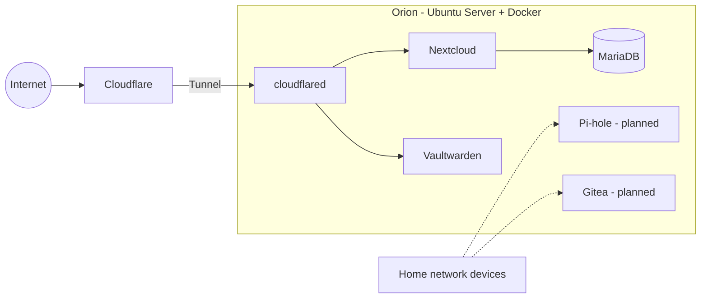

# Orion — Self-Hosted Home Server

A home server running on Ubuntu Server that hosts my own services in Docker containers: personal cloud storage and a self-hosted password manager, with network-wide DNS filtering and a private Git server on the way.

I built it to learn how self-hosting works end to end (containers, networking, remote access, backups) and to own my data instead of depending on third-party services. I recently rebuilt it from scratch. This repository documents what I built, what I decided, and what went wrong along the way.

## Services

| Service                           | Purpose                                                                          | Status  |
| --------------------------------- | -------------------------------------------------------------------------------- | ------- |
| [Nextcloud](docker/nextcloud)     | File storage and sync (Windows, macOS, iOS clients) with a MariaDB backend       | Running |
| [Vaultwarden](docker/vaultwarden) | Self-hosted password manager                                                     | Running |
| Cloudflare Tunnel                 | Secure remote access to Nextcloud and Vaultwarden, no ports opened on the router | Running |
| Pi-hole                           | DNS-level ad and tracker blocking for the home network                           | Planned |
| Gitea                             | Self-hosted Git server                                                           | Planned |

## Architecture



More detail in [docs/architecture.md](Docs/architecture.md).

## Hardware

- **Machine:** Mac Mini 2012
- **CPU / RAM:** Intel i5 3210M 16GB
- **Storage:** 480GB
- **OS:** Ubuntu Server

## Key decisions and problems solved

### Remote access: why Cloudflare Tunnel and not WireGuard

My first plan was a WireGuard VPN. It did not work because my ISP places the connection behind CGNAT / double NAT, so incoming connections never reach the server. Instead of fighting the ISP, I switched to Cloudflare Tunnel: the server makes an outbound connection, so no port forwarding is needed. Full write-up in [docs/remote-access.md](Docs/remote-access.md).

### Rebuilding Orion from scratch

After running the first version for a while, I rebuilt the server with a cleaner structure: one folder per service, each with its own `docker-compose.yml` and `.env.example`. Services are being brought back one at a time.

## Repository structure

```
orion-homelab/
├── README.md
├── LICENSE
├── .gitignore
├── docs/
│   ├── architecture.md
│   ├── remote-access.md
│   ├── backups.md             # planned
│   └── images/
│       ├── architecture.png
│       ├── orion-hardware.jpg
│       └── nextcloud-devices.png
├── docker/
│   ├── nextcloud/
│   │   ├── docker-compose.yml
│   │   └──.env.example
│   ├── vaultwarden/
│   │   ├── docker-compose.yml
│   │   └── README.md
│   ├── pihole/                # planned
│   └── gitea/                 # planned
├── cloudflared/
│   ├── config.example.yml
│   └── README.md
└── scripts/
    └── backup-nextcloud.sh    # planned
```

## Getting started

Each service lives in its own folder and can be deployed independently.

```bash
cd docker/nextcloud
docker compose up -d
```

Real `.env` files are ignored by Git. Only `.env.example` files with placeholder values are committed.

## Roadmap

- [x] Nextcloud with MariaDB, synced across Windows, macOS and iOS
- [x] Vaultwarden
- [x] Remote access through Cloudflare Tunnel
- [ ] Pi-hole for network-wide DNS filtering
- [ ] Gitea
- [ ] Automated backups (cron) of Nextcloud data and the database
- [ ] Use Orion as the backend for a personal web project ("Life Support")

## Lessons learned

- Check the network (CGNAT) before designing remote access.
- Keep one folder and one README per service; it makes the setup easy to reproduce.
- Back up before you need it.

## Security note

No credentials, internal IP addresses, or real domain names are stored in this repository. Values shown in examples are placeholders.
